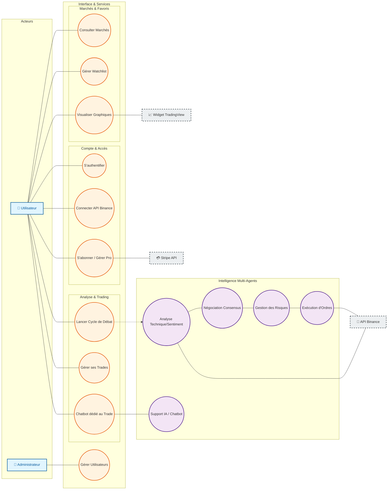
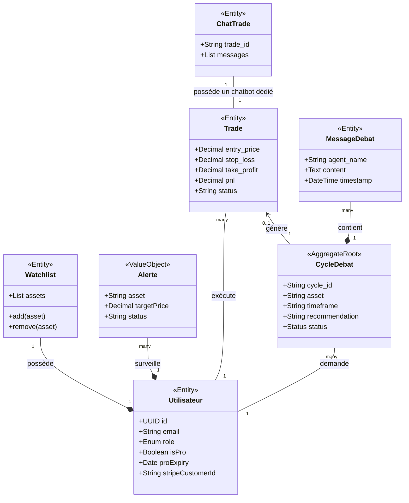
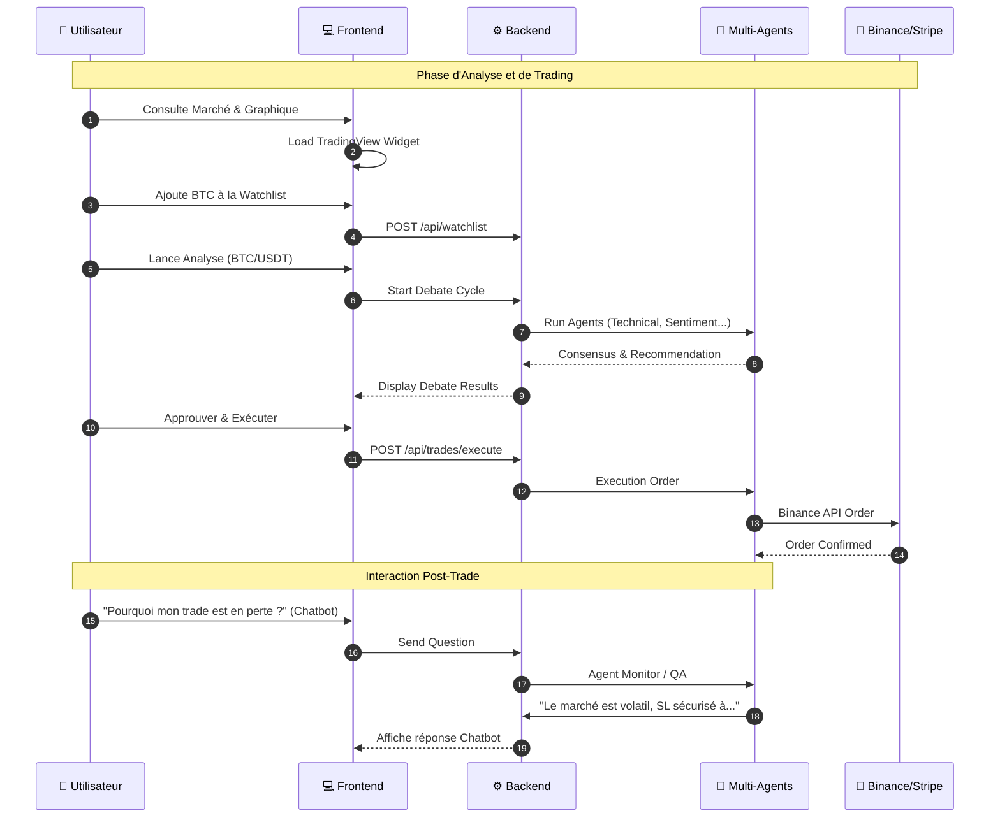

# 📊 Spécifications UML Globales - PFE

> **Projet :** Plateforme de Trading Crypto Multi-Agents  
> **Objectif :** Architecture de haut niveau pour l'analyse et l'exécution de trades automatisés.

---

## 🎯 1. Diagramme de Cas d'Utilisation
Ce diagramme illustre les interactions stratégiques entre les acteurs externes et les fonctionnalités clés du système.

---

## 🏗️ 2. Diagramme de Classes (Architecture de Données)
Vue structurelle des entités backend et de leurs inter-relations.

---

## 🔄 3. Diagramme de Séquence (Analyse -> Trade -> Chatbot)
Cinématique incluant l'interaction avec le chatbot après l'ouverture d'un trade.

---

### 🎨 Guide des Couleurs
| Composant | Couleur | Description |
| :--- | :--- | :--- |
| **Acteurs** | 🔵 Bleu | Entités humaines externes. |
| **Système** | 🟠 Orange | Fonctionnalités de base du Backend/Frontend. |
| **Agents** | 🟣 Violet | Logique métier intelligente (SMA). |
| **Externe** | ⚪ Gris | Services tiers (Binance). |
